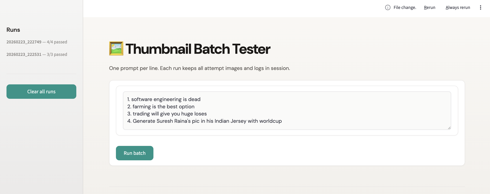
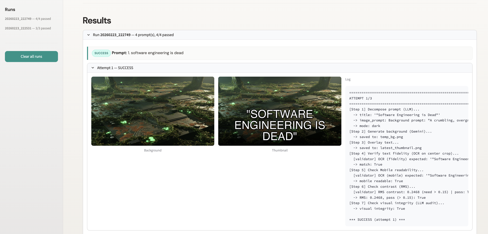
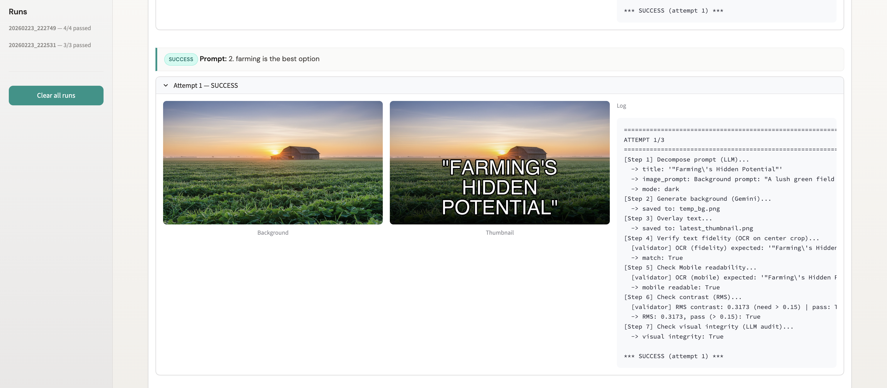

# 🖼️ Robust Multimodal Thumbnail Generation System


## 🚀 Overview

Current latent diffusion models exhibit inherent stochasticity, making them unreliable for strict typographic and layout constraints (e.g., text hallucination, geometry warping, and visual collisions).

This project solves these fundamental generative flaws by implementing a **Closed-Loop Verification Architecture**. By decoupling semantic intent from deterministic rendering and surrounding the generation process with strict machine-verifiable safeguards, this system transforms probabilistic AI generation into a highly reliable asset pipeline.


## 🧠 Core Architecture & Information Flow

The system executes via a four-phase orchestrated pipeline, preventing errors before they reach the validation layer:

1. **Semantic Decomposition (LLM)** — GPT-4o-mini translates user topics into grounded, text-free visual metaphors (e.g., "cracking neon motherboard" instead of "software engineers"). This prevents the diffusion model from attempting to render text or human faces.

2. **Constrained Generative Inference** — Gemini 2.5 Flash synthesizes the background. Negative constraints are programmatically injected to prime the latent space for typography.

3. **Deterministic Compositing (Pillow)** — Typography is rendered dynamically. A programmatic **Exponential Gradient Floor** ensures RMS Contrast > 0.15 without hard horizontal seams, preventing layout collisions while respecting YouTube-style safe margins.

4. **Autonomous Quality Verification (Closed-Loop)** — The composite image passes through a suite of validators. If any hard constraint fails, the orchestrator triggers a **self-repairing retry loop** with tightening semantic constraints (up to 3 attempts).


## 🛡️ Hard Constraints & Autonomous Auditing

This system requires zero manual inspection. Every output is verified against:

| Constraint | Method |
|------------|--------|
| **Text Fidelity (Zero Hallucination)** | EasyOCR on full frame; fuzzy-match against expected title. |
| **Legibility** | RMS contrast floor of 0.15 to reduce cognitive load. |
| **Mobile Readability** | Downsamples to ≤200px width and runs a sequence-similarity check to ensure typography survives pixel-aliasing. |
| **Visual Integrity (VLM-as-a-Judge)** | Because traditional CV cannot semantically differentiate "art" from "distorted AI hands," a **Gemini VLM Auditor** scans the background for faces, hands, and printed text before typography is applied. |


## 💻 Installation & Setup

### 1. Clone the repository and install dependencies

```bash
pip install -r requirements.txt
```

### 2. Configure environment variables

Copy the example env file and set your gateway URL and token (no API keys are hardcoded in code):

```bash
cp .env.example .env
```

Edit `.env`:

```env
GATEWAY_BASE=https://your-gateway-url
token=your_gateway_token
```

The app uses a single gateway for both OpenAI-compatible (decomposition) and Gemini (image generation + VLM audit) endpoints.


## 🎮 Usage

### API server

```bash
python main.py
```

- **Endpoint:** `POST http://localhost:8000/generate?prompt=Your+Topic`
- **Example:** `python test_api.py` or `curl -X POST "http://localhost:8000/generate?prompt=End+of+the+World"`

**Success response:**
```json
{"status": "success", "url": "latest_thumbnail.png", "attempts": 1}
```
**Failure (after 3 attempts):**
```json
{"status": "failed", "error_type": "ConstraintViolation", "message": "...", "failure_log": [], "fallback_image": "outputs/fallback_solid_color.png"}
```

### Batch testing (Streamlit UI)

To facilitate bulk evaluation and prompt generalization testing, a Streamlit UI is provided:

```bash
streamlit run streamlit_batch.py
```

Enter one prompt per line and click **Run batch**. All attempts (background + thumbnail images and logs) are kept in session. Outputs are written to `batch_output/run_<id>/`.


## 📸 UI — Batch testing

This is how the Streamlit batch testing UI looks.

**1. Prompt input** — Enter one prompt per line and click **Run batch**.



**2. Run results** — Each run shows status (success/fail) and expandable attempts.



**3. Attempt details** — Background and thumbnail per attempt, with logs.




## 🐛 Observing the Recovery Loop

Because the prompt decomposition is highly effective, the system often passes on Attempt 1. To observe **Degraded Graceful Recovery** in action:

- Use prompts that are likely to fail the VLM audit on the first try (e.g., topics that may trigger faces or text in the background). The orchestrator will retry with **stricter semantic constraints** (e.g., *"Abstract geometric shapes and tech patterns only. Strictly NO people or faces"* → *"Minimalist solid color gradient. Completely abstract. Zero human subjects or silhouettes"*).
- Inspect the Streamlit batch UI: failed attempts and their failure reasons (e.g. `visual_integrity`, `text_fidelity`) are shown per attempt, so you can see how each retry tightens the pipeline.


## 📁 Outputs (local only; see `.gitignore`)

- `temp_bg.png` — current run background  
- `latest_thumbnail.png` — final thumbnail  
- `outputs/fallback_solid_color.png` — used when all 3 attempts fail  
- `batch_output/` — per-run attempt images (Streamlit batch)  
- `ocr_mask.png`, `mobile_test.png` — validator intermediates  


## 🏁 Research Conclusion

Rather than attempting to "prompt engineer" a probabilistic model into generating perfect text and layouts, this system **encapsulates the generative model within a deterministic mathematical and semantic framework**. The resulting pipeline achieves strong compliance with hard constraints, delivering a reliable asset generation tool suitable for production prototyping.
